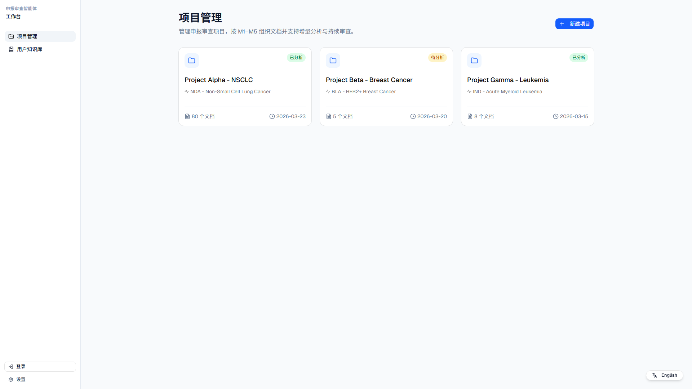
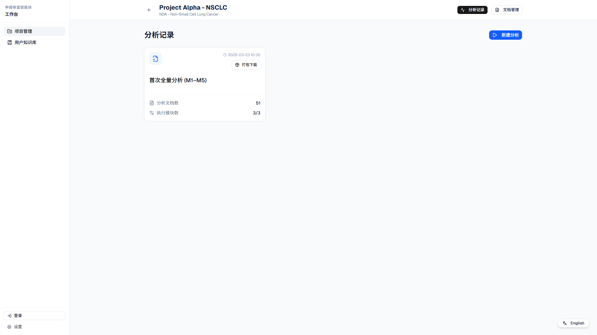
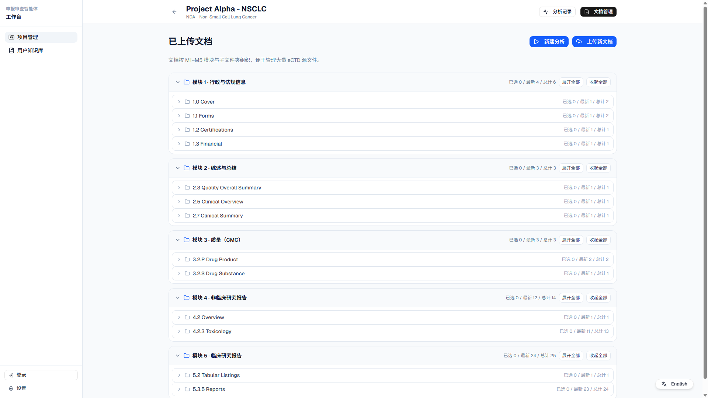
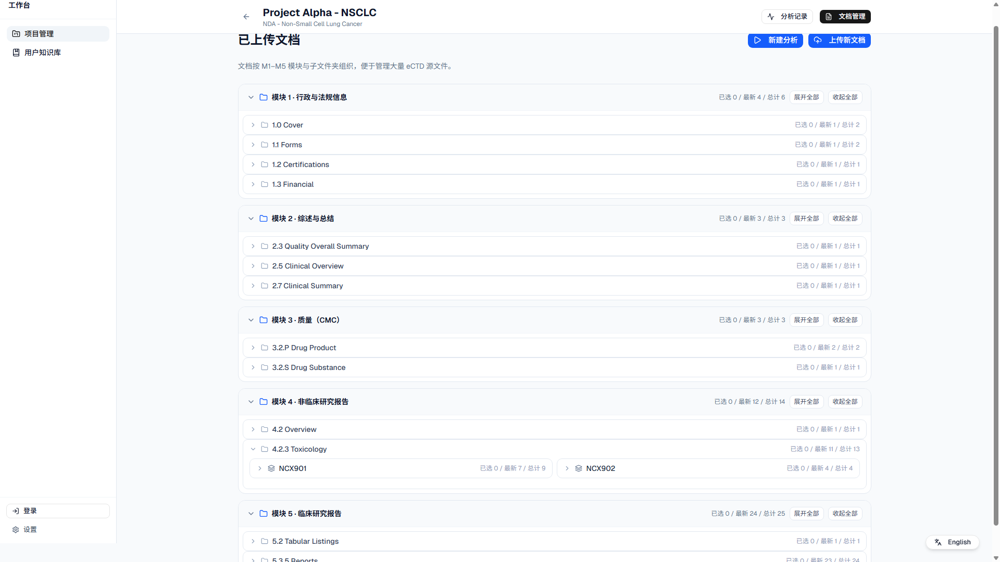
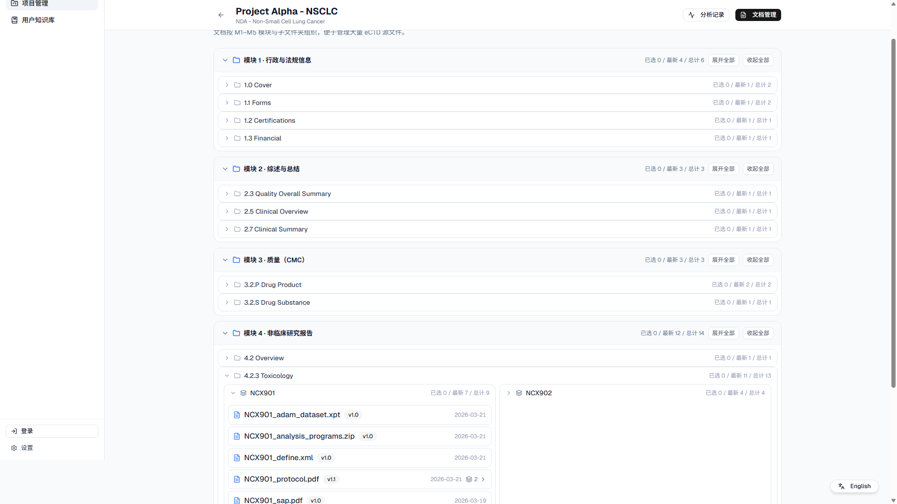
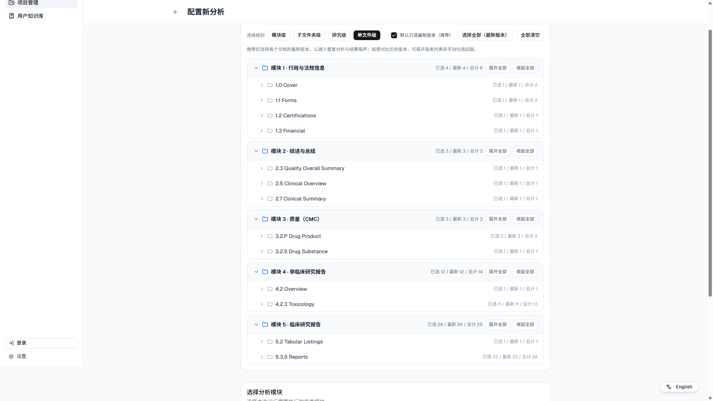
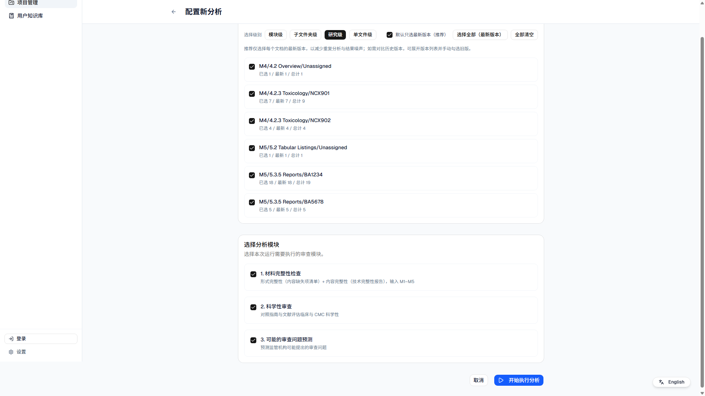

## 申报审查智能体（Submission Review Agent）站点流转示意

站点地址：`https://yuanmenghe.github.io/Demo/fda-submission-gap-analyzer/`

### 1) 进入站点 → 项目管理（Project list）

你会先看到「项目管理」列表页，展示已有项目（示例：Project Alpha/Beta/Gamma），并可新建项目。

### 2) 选择一个项目 → 进入项目工作区（Workspace）

点击某个项目卡片后进入该项目工作区。工作区顶部提供「分析记录 / 文档管理」切换，并提供「新建分析」入口。

### 3) 文档管理 → 按 M1–M5 分模块管理文档

在「文档管理」页，文档按 eCTD 的 M1–M5 模块与子文件夹组织。\n
- **模块**：全宽单列展示（避免 5 个模块在大屏下左右跳读）。\n
- **计数**：每一行展示「已选/最新/总计」。\n
- **版本**：每个文件条目展示版本标签（如 `v1.1`）与日期。\n

### 4) M4/M5：按 studyID 聚合（模块 → 文件夹 → study → 文件）

在 M4/M5（非临床/临床）中，文件可按 study 维度爆炸增长。\n
系统会从文件名中抽取 `studyId`（示例：`NCX901_*`、`BA1234_*`），并在同一文件夹下按 study 聚合成卡片。\n

展开某个 study（示例：NCX901）后，可看到该 study 下的文件条目（含版本组/历史版本展开入口）。\n
（注：为了 UI 一致性，study 卡片展开/不展开都保持半宽两栏展示。）\n

### 5) 新建分析（Configure New Analysis）→ 选择文档范围与模块

在工作区点击「新建分析」，进入配置页。\n
你可以切换选择级别（模块级/子文件夹级/研究级/单文件级），并可开启「默认只选最新版本（推荐）」。\n

### 6) 研究级（Study level）选择：一次勾选一个 study 的最新集合

选择级别切到「研究级」后，M4/M5 会以 `模块/文件夹/studyId` 作为选择单位，展示同样的「已选/最新/总计」与半选态。\n
这用于快速覆盖“每个 study 重复一套文件”的典型场景。\n

### 7) 执行分析 → 查看报告 → 导出

完成配置后点击「开始执行分析」，系统将生成审查报告（材料完整性 / 科学性审查 / 可能的审查问题预测）。\n
分析完成后，可在「分析记录」中查看历史结果，并进行打包导出（Bundle）。\n

